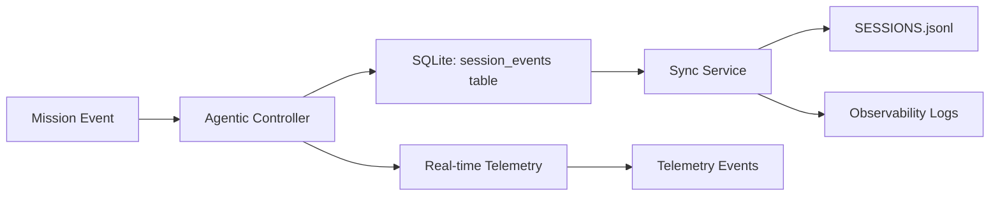
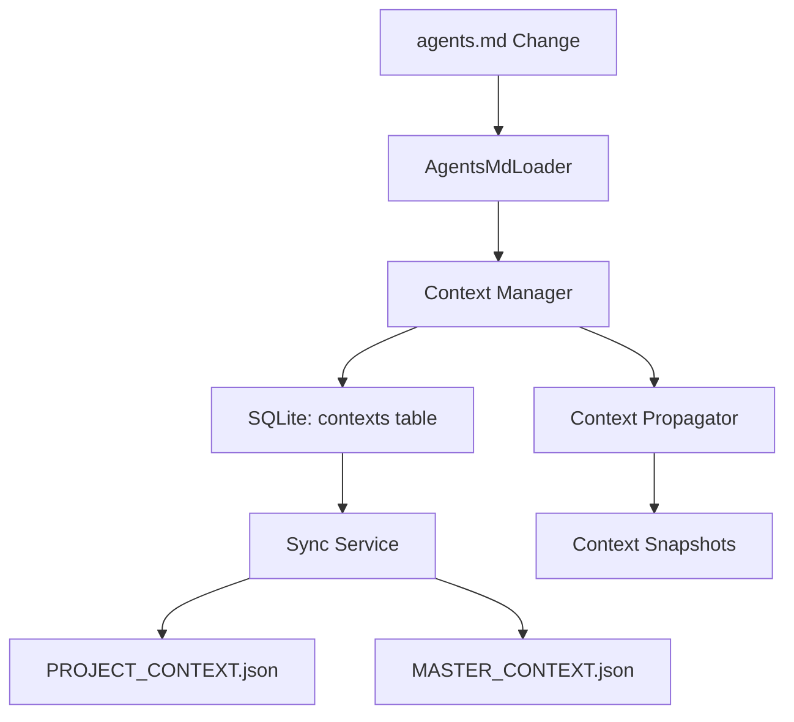

# CMOS & Mission Protocol Integration Architecture Plan

## Architecture Vision

Create a unified, bidirectional integration between Mission Protocol's TypeScript intelligence layer and CMOS's SQLite canonical datastore, with automatic synchronization, strong consistency guarantees, and zero data divergence.

## Core Architecture Components

### 1. TypeScript SQLite Client Layer

**Location**: `src/intelligence/sqlite-client.ts`

**Purpose**: Direct SQLite access from TypeScript with schema awareness

**Key Features**:
- Connection pooling and management
- Schema validation and migration
- Type-safe query builders
- Transaction support
- Error handling and retry logic

**API Surface**:
```typescript
interface SQLiteClient {
  // Mission operations
  getMission(missionId: string): Promise<Mission | null>;
  updateMission(missionId: string, updates: Partial<Mission>): Promise<void>;
  listMissions(filters?: MissionFilters): Promise<Mission[]>;
  
  // Context operations
  getContext(contextId: string): Promise<Context | null>;
  setContext(contextId: string, payload: Context, options?: ContextOptions): Promise<void>;
  addContextSnapshot(contextId: string, payload: Context): Promise<boolean>;
  
  // Session events
  logSessionEvent(event: SessionEvent): Promise<void>;
  getSessionEvents(filters?: SessionFilters): Promise<SessionEvent[]>;
  
  // Telemetry
  recordTelemetry(payload: TelemetryPayload): Promise<void>;
  
  // Parity management
  validateParity(): Promise<ParityReport>;
  syncToFiles(): Promise<void>;
}
```

### 2. Synchronization Service

**Location**: `src/intelligence/sync-service.ts`

**Purpose**: Automatic bidirectional sync between SQLite and file mirrors

**Key Features**:
- Event-driven synchronization
- Conflict resolution strategies
- Batch operations for performance
- Sync status monitoring
- Backpressure handling

**Sync Flow**:
```
SQLite (Canonical) → Sync Service → File Mirrors (Secondary)
        ↑                                      ↓
        └─────────── Conflict Resolution ──────┘
```

### 3. Enhanced Agentic Controller

**Location**: `src/intelligence/agentic-controller.ts` (enhanced)

**Modifications**:
- Use SQLite client for mission state persistence
- Write session events to SQLite first
- Maintain file mirrors for backward compatibility
- Add sync hooks for context updates

**State Management**:
```typescript
class AgenticController {
  private sqliteClient: SQLiteClient;
  private syncService: SyncService;
  
  async startMission(missionId: string, options: StartMissionOptions): Promise<void> {
    // 1. Write to SQLite (canonical)
    await this.sqliteClient.updateMission(missionId, {
      status: 'in_progress',
      startedAt: new Date().toISOString(),
      ...options
    });
    
    // 2. Sync to files (secondary)
    await this.syncService.syncMissionToFile(missionId);
    
    // 3. Emit events
    this.emit('missionStarted', { missionId, ...options });
  }
}
```

### 4. Unified Context Manager

**Location**: `src/intelligence/context-manager.ts`

**Purpose**: Single interface for all context operations

**Responsibilities**:
- Load agents.md and update PROJECT_CONTEXT
- Manage MASTER_CONTEXT snapshots
- Handle context propagation
- Coordinate with SQLite and file storage

**Context Flow**:
```
agents.md → Context Manager → SQLite (contexts table)
                ↓
        PROJECT_CONTEXT.json (mirror)
                ↓
        MASTER_CONTEXT.json (mirror)
```

## Data Flow Architecture

### Mission Lifecycle Flow

```mermaid
graph TD
    A[Mission Protocol Tools] --> B[Agentic Controller]
    B --> C[SQLite Client]
    C --> D[SQLite DB (Canonical)]
    D --> E[Sync Service]
    E --> F[File Mirrors]
    E --> G[SESSIONS.jsonl]
    E --> H[PROJECT_CONTEXT.json]
    E --> I[agentic_state.json]
    
    B --> J[Observability]
    J --> D
    J --> K[Telemetry Events]
```

### Session Event Flow



### Context Update Flow



## Implementation Phases

### Phase 1: Foundation (Weeks 1-3)

#### Week 1: SQLite Client
- [ ] Create `src/intelligence/sqlite-client.ts`
- [ ] Implement connection management
- [ ] Add schema validation
- [ ] Create TypeScript types for all tables
- [ ] Add basic CRUD operations

#### Week 2: Sync Service
- [ ] Create `src/intelligence/sync-service.ts`
- [ ] Implement file watching
- [ ] Add SQLite change detection
- [ ] Create conflict resolution logic
- [ ] Add sync status monitoring

#### Week 3: Integration & Testing
- [ ] Integrate SQLite client with existing tools
- [ ] Add parity validation to startup
- [ ] Create comprehensive test suite
- [ ] Benchmark performance

### Phase 2: Core Integration (Weeks 4-7)

#### Week 4: Agentic Controller Updates
- [ ] Refactor to use SQLite client
- [ ] Add sync hooks for all state changes
- [ ] Update mission lifecycle methods
- [ ] Maintain backward compatibility

#### Week 5: Context Management
- [ ] Create unified context manager
- [ ] Update agents-md-loader
- [ ] Add context snapshot management
- [ ] Implement context propagation

#### Week 6: Session Events
- [ ] Update session logging to use SQLite
- [ ] Add real-time sync to SESSIONS.jsonl
- [ ] Enhance observability integration
- [ ] Add event streaming capabilities

#### Week 7: Testing & Validation
- [ ] Integration test suite
- [ ] Parity validation tests
- [ ] Performance benchmarks
- [ ] Migration testing

### Phase 3: Optimization (Weeks 8-10)

#### Week 8: Performance
- [ ] Optimize sync operations
- [ ] Add batch processing
- [ ] Implement caching layer
- [ ] Reduce redundant I/O

#### Week 9: Observability
- [ ] Unified telemetry pipeline
- [ ] Sync monitoring dashboard
- [ ] Alerting for parity issues
- [ ] Performance metrics

#### Week 10: Migration & Documentation
- [ ] Migration tools for existing projects
- [ ] Update documentation
- [ ] Create migration guide
- [ ] Training materials

## Technical Specifications

### Database Schema Alignment

**Current SQLite Schema** (CMOS):
```sql
-- missions table
CREATE TABLE missions (
  id TEXT PRIMARY KEY,
  sprint_id TEXT REFERENCES sprints(id),
  name TEXT NOT NULL,
  status TEXT NOT NULL,
  completed_at TEXT,
  notes TEXT,
  metadata TEXT
);

-- contexts table
CREATE TABLE contexts (
  id TEXT PRIMARY KEY,
  source_path TEXT NOT NULL,
  content TEXT NOT NULL,
  updated_at TEXT
);

-- session_events table
CREATE TABLE session_events (
  id INTEGER PRIMARY KEY AUTOINCREMENT,
  ts TEXT,
  agent TEXT,
  mission TEXT,
  action TEXT,
  status TEXT,
  summary TEXT,
  next_hint TEXT,
  raw_event TEXT NOT NULL
);
```

**Enhanced Schema** (Integration):
```sql
-- Add sync metadata
ALTER TABLE missions ADD COLUMN last_synced_at TEXT;
ALTER TABLE missions ADD COLUMN sync_status TEXT; -- 'synced', 'pending', 'failed'

ALTER TABLE contexts ADD COLUMN last_synced_at TEXT;
ALTER TABLE contexts ADD COLUMN sync_status TEXT;

-- Add sync tracking table
CREATE TABLE sync_events (
  id INTEGER PRIMARY KEY AUTOINCREMENT,
  entity_type TEXT NOT NULL, -- 'mission', 'context', 'session'
  entity_id TEXT NOT NULL,
  direction TEXT NOT NULL, -- 'sqlite_to_file', 'file_to_sqlite'
  status TEXT NOT NULL, -- 'success', 'failed', 'conflict'
  timestamp TEXT NOT NULL,
  details TEXT
);
```

### File Mirror Structure

**Maintained for Backward Compatibility**:
```
cmos/
├── missions/
│   └── backlog.yaml          # Mirror of SQLite missions + sprints
├── PROJECT_CONTEXT.json      # Mirror of SQLite contexts (project_context)
├── context/
│   └── MASTER_CONTEXT.json   # Mirror of SQLite contexts (master_context)
├── SESSIONS.jsonl           # Mirror of SQLite session_events
└── context/
    └── agentic_state.json   # Mission Protocol state (to be migrated)
```

### Sync Configuration

**Default Sync Behavior**:
```typescript
interface SyncConfig {
  // Sync direction
  direction: 'bidirectional' | 'sqlite_to_file' | 'file_to_sqlite';
  
  // Sync triggers
  onSQLiteChange: boolean;  // Sync when SQLite changes
  onFileChange: boolean;    // Sync when files change
  onSchedule: boolean;      // Periodic sync
  
  // Conflict resolution
  conflictResolution: 'sqlite_wins' | 'file_wins' | 'timestamp' | 'manual';
  
  // Performance
  batchSize: number;        // Number of records per batch
  debounceMs: number;       // Debounce file changes
  maxRetries: number;       // Max sync retry attempts
}
```

**Default Configuration**:
```typescript
const DEFAULT_SYNC_CONFIG: SyncConfig = {
  direction: 'bidirectional',
  onSQLiteChange: true,
  onFileChange: true,
  onSchedule: true,
  conflictResolution: 'sqlite_wins', // SQLite is canonical
  batchSize: 100,
  debounceMs: 500,
  maxRetries: 3
};
```

## Error Handling & Recovery

### Sync Failure Modes

1. **SQLite Unavailable**
   - Fallback to file-based operations
   - Queue changes for later sync
   - Alert on extended outages

2. **File System Errors**
   - Continue with SQLite operations
   - Log file sync failures
   - Retry with exponential backoff

3. **Conflict Detection**
   - Compare timestamps
   - Use conflict resolution strategy
   - Log conflicts for review
   - Create conflict resolution UI

### Recovery Procedures

```typescript
class SyncRecovery {
  async recoverFromFailure(failure: SyncFailure): Promise<void> {
    switch (failure.type) {
      case 'sqlite_unavailable':
        await this.fallbackToFiles(failure.pendingChanges);
        break;
      case 'file_system_error':
        await this.queueForRetry(failure.failedSyncs);
        break;
      case 'conflict':
        await this.resolveConflict(failure.conflict);
        break;
    }
  }
  
  async verifyDataIntegrity(): Promise<IntegrityReport> {
    const sqliteData = await this.sqliteClient.getAllData();
    const fileData = await this.fileClient.getAllData();
    return this.compareData(sqliteData, fileData);
  }
}
```

## Monitoring & Observability

### Key Metrics

1. **Sync Performance**
   - Sync latency (p50, p95, p99)
   - Sync success rate
   - Conflict rate
   - Queue depth

2. **Data Integrity**
   - Parity check results
   - Divergence detection
   - Recovery success rate

3. **System Health**
   - SQLite connection pool stats
   - File system I/O metrics
   - Error rates by component

### Alerting Rules

```yaml
alerts:
  - name: sync_latency_high
    condition: sync_latency_p99 > 5s
    severity: warning
    
  - name: sync_failure_rate
    condition: sync_failure_rate > 0.05
    severity: critical
    
  - name: data_divergence
    condition: parity_check_failures > 0
    severity: critical
    
  - name: sqlite_unavailable
    condition: sqlite_availability < 0.99
    severity: critical
```

## Security Considerations

1. **Database Access Control**
   - File system permissions for SQLite file
   - Restricted access to sync service
   - Audit logging for all changes

2. **Data Validation**
   - Schema validation on all writes
   - Input sanitization
   - SQL injection prevention

3. **Backup & Recovery**
   - Automated SQLite backups
   - Point-in-time recovery
   - File mirror backups

## Migration Strategy

### For Existing Projects

1. **Assessment Phase**
   - Run parity validation
   - Identify custom integrations
   - Estimate migration effort

2. **Preparation Phase**
   - Install new dependencies
   - Configure sync service
   - Set up monitoring

3. **Migration Phase**
   - Seed SQLite from files
   - Enable bidirectional sync
   - Verify parity
   - Switch to SQLite-first operations

4. **Validation Phase**
   - Run test suite
   - Verify all integrations
   - Monitor sync performance
   - Update documentation

### Backward Compatibility

- Maintain file mirrors indefinitely
- Provide fallback mechanisms
- Support gradual migration
- Keep existing APIs functional

## Success Criteria

1. **Functional**
   - Zero data loss during migration
   - Automatic parity enforcement
   - Real-time synchronization
   - Conflict resolution working

2. **Performance**
   - <100ms sync latency (p99)
   - <1s mission state updates
   - <5% overhead vs file-only operations
   - >99.9% sync success rate

3. **Reliability**
   - Automatic recovery from failures
   - Comprehensive error handling
   - Data integrity verification
   - Graceful degradation

4. **Developer Experience**
   - Simple configuration
   - Clear documentation
   - Useful error messages
   - Easy debugging tools